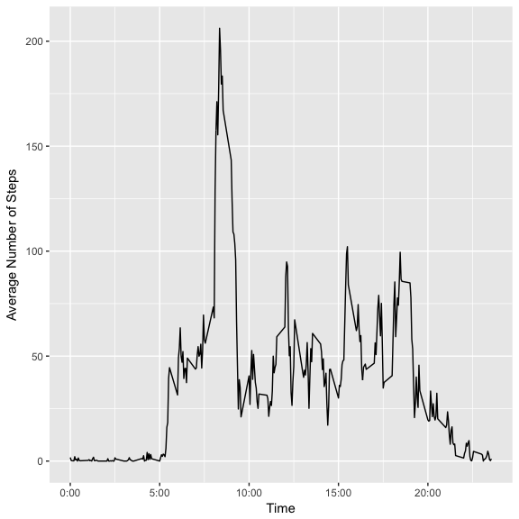
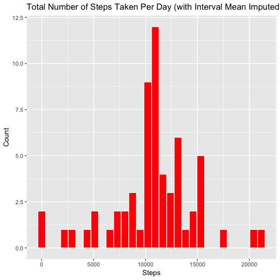
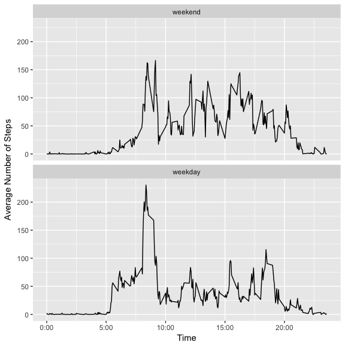

# Reproducible Research: Peer Assessment 1


## Loading and preprocessing the data
First, we'll load the libraries and dependencies which will be required for processing and visualization.


```r
list.of.packages <- c("tidyverse","ggplot2","lubridate","forcats")
new.packages <- list.of.packages[!(list.of.packages %in% installed.packages()[, "Package"])]
if(length(new.packages)) install.packages(new.packages)
library(tidyverse); library(ggplot2); library(lubridate); library(forcats)
```

```
## Loading tidyverse: ggplot2
## Loading tidyverse: tibble
## Loading tidyverse: tidyr
## Loading tidyverse: readr
## Loading tidyverse: purrr
## Loading tidyverse: dplyr
```

```
## Conflicts with tidy packages ----------------------------------------------
```

```
## filter(): dplyr, stats
## lag():    dplyr, stats
```

```
## 
## Attaching package: 'lubridate'
```

```
## The following object is masked from 'package:base':
## 
##     date
```

Then, we'll read in the csv data as a dataframe using the tidyverse::readr package. 


```r
unzip("activity.zip")
activity <- read_csv("activity.csv")
```

```
## Parsed with column specification:
## cols(
##   steps = col_integer(),
##   date = col_date(format = ""),
##   interval = col_integer()
## )
```

## What is mean total number of steps taken per day?

Calculate the total number of steps taken each day

```r
stepsByDay <- activity %>% group_by(date) %>% summarise(steps=sum(steps))
```

Create a histogram of Total Number of Steps Taken Per Day

```r
ggplot(data=stepsByDay) + geom_histogram(mapping=aes(x=steps), fill="red", color="white", bins=30, na.rm=TRUE) + xlab("Steps") + ylab("Count") + ggtitle("Total Number of Steps Taken Per Day")
```

<!-- -->


Calculate and report the mean of total number of steps taken per day

```r
meanStepsByDay <- stepsByDay %>% summarise(steps=mean(steps, na.rm=TRUE))
meanStepsByDay 
```

```
## # A tibble: 1 x 1
##      steps
##      <dbl>
## 1 10766.19
```

Calculate and report the median number of steps taken per day

```r
medianStepsByDay <- stepsByDay %>% summarise(MedianDailySteps=median(steps, na.rm=TRUE))
medianStepsByDay
```

```
## # A tibble: 1 x 1
##   MedianDailySteps
##              <int>
## 1            10765
```

## What is the average daily activity pattern?

Make a time series plot of the 5-minute interval (x-axis) and the average number of steps taken averaged across all days (y-axis)

```r
intActivity <- activity %>% group_by(interval) %>% summarise(stepsAverage=mean(steps, na.rm=TRUE))
ggplot(intActivity, aes(interval, stepsAverage)) + geom_line() + xlab("Time") + ylab("Average Number of Steps") + scale_x_continuous(breaks=c(0,500,1000,1500,2000), labels=c("0:00","5:00","10:00","15:00","20:00"))
```

<!-- -->


Which 5-minute interval, on average across all the days in the dataset, contains the maximum number of steps?

```r
intActivity %>% filter(stepsAverage==max(stepsAverage)) 
```

```
## # A tibble: 1 x 2
##   interval stepsAverage
##      <int>        <dbl>
## 1      835     206.1698
```

## Imputing missing values

Calculate and report the total number of missing values in the dataset (i.e. the total number of rows with NAs)

```r
activity %>% summarise(steps=sum(is.na(steps)))
```

```
## # A tibble: 1 x 1
##   steps
##   <int>
## 1  2304
```

Use the mean number of steps for an interval to fill all of the missing values in the dataset.
Create a new dataset that is equal to the original dataset, but with the missing data filled in.

```r
imputeSteps <- activity %>% group_by(interval) %>% mutate(steps=ifelse(is.na(steps),mean(steps, na.rm=TRUE),steps))
```


```r
imputedStepsByDay <- imputeSteps %>% group_by(date) %>% summarise(steps=sum(steps))
```

Make a histogram of the total number of steps taken each day.

```r
ggplot(data=imputedStepsByDay) + geom_histogram(mapping=aes(x=steps), fill="red", color="white", bins=30, na.rm=TRUE) + xlab("Steps") + ylab("Count") + ggtitle("Total Number of Steps Taken Per Day (with Interval Mean Imputed for NAs)")
```

<!-- -->


Calculate and report the mean number of steps taken per day.

```r
impMeanStepsByDay <- imputedStepsByDay %>% summarise(MeanDailySteps=mean(steps))
impMeanStepsByDay
```

```
## # A tibble: 1 x 1
##   MeanDailySteps
##            <dbl>
## 1       10766.19
```

Calculate and report the median number of steps taken per day.


```r
impMedianStepsByDay <- imputedStepsByDay %>% summarise(MedianDailySteps=median(steps))
impMedianStepsByDay
```

```
## # A tibble: 1 x 1
##   MedianDailySteps
##              <dbl>
## 1         10766.19
```

Calculate the difference between imputed mean and mean values where NAs are dropped.


```r
impMeanStepsByDay - meanStepsByDay
```

```
##   MeanDailySteps
## 1              0
```

Note that there is no difference between the imputed mean values and mean values where NAs are dropped.

Calculate the difference between imputed mean and mean values where NAs are dropped. 

```r
impMedianStepsByDay - medianStepsByDay
```

```
##   MedianDailySteps
## 1         1.188679
```

There is a 1+/- step difference when using imputed mean values for NA values. This is practically neglible.

## Are there differences in activity patterns between weekdays and weekends?
First, convert date to an ordered factor variable of days with two levels: weekend and weekday.

```r
activityDays <- imputeSteps %>% mutate(day=wday(date, label=TRUE, abbr=FALSE)) 
activityDaysFactor <- activityDays %>% mutate(daytype=fct_collapse(day, weekend=c("Sunday", "Saturday"), weekday=c("Monday","Tuesday","Wednesday", "Thursday","Friday")))
```

Then make a panel plot containing a time-series plot of average steps taken averaged across all weekdays and weekends.

```r
intervalWeekendWeekday <- activityDaysFactor %>% group_by(interval, daytype) %>% summarise(steps=mean(steps))
ggplot(intervalWeekendWeekday, aes(interval, steps)) + geom_line() + facet_wrap(~ daytype, nrow=2) + xlab("Time") + ylab("Average Number of Steps") + scale_x_continuous(breaks=c(0,500,1000,1500,2000), labels=c("0:00","5:00","10:00","15:00","20:00"))
```

<!-- -->


